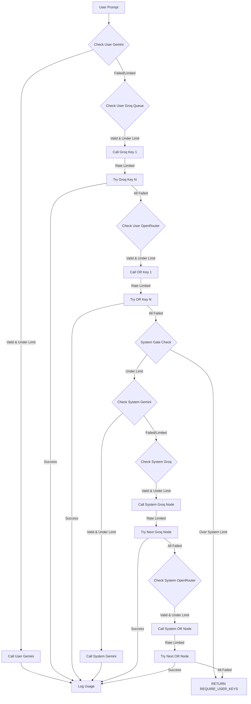
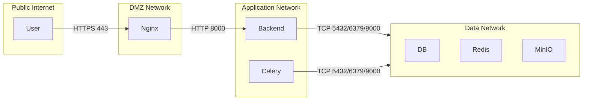
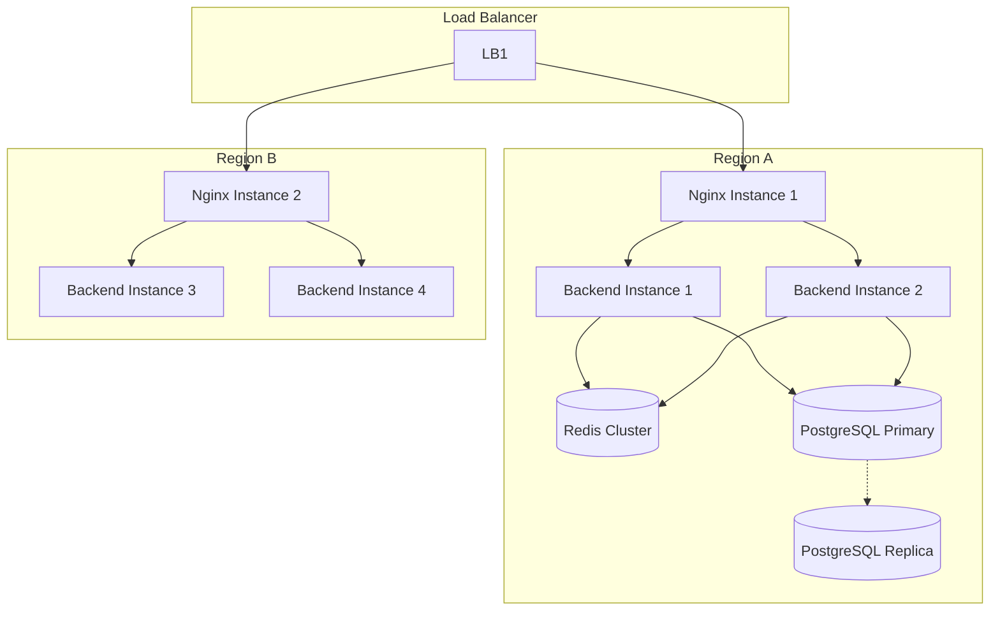
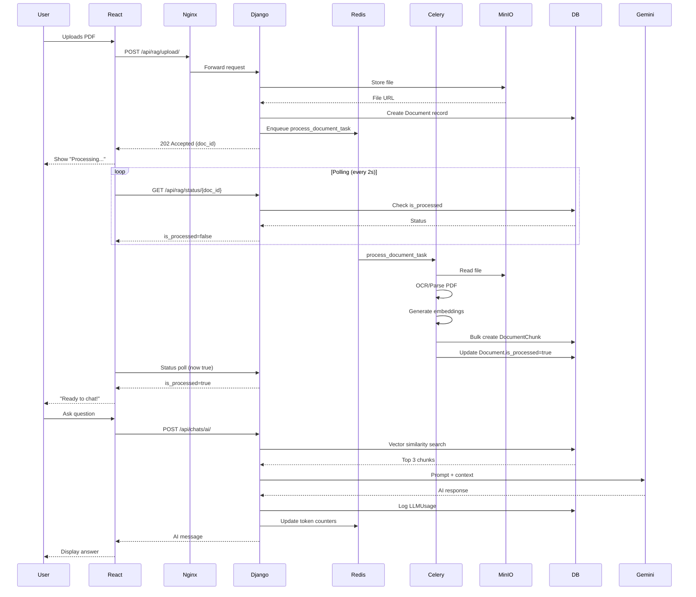

# System Architecture

<!-- Diagram: C4 Context | Priority: 🔴 | Purpose: High-level system overview showing user interactions and external dependencies -->

## System Context (C4 Level 1)

```mermaid
%%{init: {'theme': 'base', 'themeVariables': {
  'primaryColor': '#2563eb',
  'primaryBorderColor': '#1d4ed8',
  'primaryTextColor': '#fff',
  'lineColor': '#64748b',
  'secondaryColor': '#475569',
  'tertiaryColor': '#334155'
}}}%%
C4Context
  title System Context diagram for RAG Document Agent

  Person(user, "End User", "Interacts with the platform via browser")
  Person(admin, "Admin User", "Manages users, monitors system health")

  System(rag_agent, "RAG Document Agent", "Allows users to upload documents and query them using AI with multi-provider fallback")

  System_Ext(email, "SMTP Server", "Sends OTP and welcome emails")
  System_Ext(google, "Google OAuth", "Handles social authentication")
  System_Ext(razorpay, "Razorpay", "Processes payments for token top-ups")
  System_Ext(gemini, "Google Gemini API", "Primary LLM provider")
  System_Ext(groq, "Groq API", "First fallback LLM provider")
  System_Ext(openrouter, "OpenRouter API", "Secondary fallback LLM provider")

  Rel(user, rag_agent, "Uses", "HTTPS")
  Rel(admin, rag_agent, "Manages", "HTTPS")
  Rel(rag_agent, email, "Sends emails", "SMTP")
  Rel(rag_agent, google, "Authenticates via", "OAuth 2.0")
  Rel(rag_agent, razorpay, "Processes payments", "REST API")
  Rel(rag_agent, gemini, "Primary AI calls", "REST API")
  Rel(rag_agent, groq, "Fallback AI calls", "REST API")
  Rel(rag_agent, openrouter, "Final fallback", "REST API")
The RAG Document Agent operates as a modular monolith with clear separation of concerns. Users interact through a React-based single-page application, while administrators access enhanced dashboards for system management. The system orchestrates six distinct external services, with a sophisticated fallback mechanism ensuring AI availability even when individual providers fail.

**Why this architecture?** A modular monolith was chosen over microservices because:
- **Team size**: Small development team benefits from simpler deployment and debugging
- **Domain cohesion**: Authentication, document processing, and AI orchestration are tightly coupled
- **Data consistency**: ACID transactions across auth and RAG features without distributed transaction complexity
- **Startup velocity**: Faster feature development without service boundary overhead

**Trade-offs:**
- **Scaling**: Cannot scale individual components independently (but can horizontally replicate the monolith)
- **Technology lock-in**: All services must share the same stack (Python/Django)
- **Deployment risk**: Single deploy affects all features simultaneously

---

<!-- Diagram: C4 Container | Priority: 🔴 | Purpose: Internal service decomposition showing containers and their interactions -->

## Container Architecture (C4 Level 2)

```mermaid
C4Container
  title Container diagram - Internal Structure

  Person(user, "End User", "Browser")
  Person(admin, "Admin User", "Browser")

  System_Boundary(backend, "Backend System") {
    Container(react, "React SPA", "TypeScript, Vite", "Provides the user interface with real-time updates and optimistic UI")
    Container(nginx, "Nginx Reverse Proxy", "Nginx", "Routes requests, terminates SSL, serves static files")
    Container(django, "Django Application", "Python, Django 5.2", "Handles business logic, authentication, RAG orchestration")
    Container(celery, "Celery Workers", "Python, Celery", "Processes async tasks: document parsing, embedding generation, emails")
    Container(redis, "Redis", "Redis 7", "Message broker, cache (OTPs, rate limits, dead keys), session store")
    Container(db, "PostgreSQL + pgvector", "PostgreSQL 15", "Primary database with vector similarity search")
    Container(minio, "MinIO Object Storage", "MinIO", "S3-compatible storage for user documents and avatars")
  }

  Rel(user, react, "Uses", "HTTPS")
  Rel(admin, react, "Uses", "HTTPS")
  Rel(react, nginx, "API calls", "HTTPS")
  Rel(nginx, django, "Proxies requests", "HTTP")
  Rel(django, db, "Reads/Writes", "SQL")
  Rel(django, redis, "Caches/Queues", "Redis Protocol")
  Rel(django, minio, "Stores/Retrieves", "S3 API")
  Rel(django, celery, "Enqueues tasks", "Redis")
  Rel(celery, db, "Reads/Writes", "SQL")
  Rel(celery, redis, "Consumes tasks", "Redis Protocol")
  Rel(celery, minio, "Reads documents", "S3 API")
```

The container architecture reveals the system's internal plumbing. The React frontend communicates exclusively through Nginx, which terminates SSL and provides a unified entry point. The Django application orchestrates the core logic, delegating time-consuming tasks to Celery workers to maintain UI responsiveness.

**Key Interaction Patterns:**

1. **Synchronous Flow (User Requests)**
   ```
   React → Nginx → Django → (DB/Redis/MinIO) → Response
   ```
   Used for: Authentication, chat history, settings retrieval

2. **Asynchronous Flow (Document Processing)**
   ```
   React → Nginx → Django → Redis Queue → Celery → MinIO → DB → Status polling
   ```
   Used for: PDF parsing, OCR, embedding generation

3. **Real-time Flow (Chat)**
   ```
   React → Nginx → Django → (RAG Service → External APIs) → Streaming response
   ```
   Used for: AI conversations with optimistic UI updates

**Why Celery over alternatives?** Celery provides:
- **Redis as both broker and result backend** (reduces infrastructure complexity)
- **Task retries and dead-letter queues** (critical for document processing)
- **Integration with Django models** (native ORM access in tasks)
- **Rate limiting** (can control API call concurrency to external providers)

---

<!-- Diagram: C4 Component | Priority: 🔴 | Purpose: Detailed breakdown of the Django application's internal components -->

## Component Architecture (C4 Level 3)

```mermaid
C4Component
  title Component diagram - Django Application Internals

  Container_Boundary(django, "Django Application") {
    Component(auth_app, "Social Auth App", "socialauth", "Handles user registration, OTP flow, OAuth, JWT management")
    Component(chat_app, "Chat App", "chat", "Manages conversations, documents, RAG orchestration")
    
    Component(rag_service, "RAG Service", "rag_service.py", "6-tier fallback engine, token accounting, dead key detection")
    Component(otp_service, "OTP Service", "otp_service.py", "OTP generation, rate limiting, verification with Redis")
    Component(email_service, "Email Service", "email_service.py", "HTML email templating, async sending")
    
    Component(api_layer, "API Layer", "views.py, serializers.py", "DRF viewsets, request validation, response formatting")
    Component(models, "Domain Models", "models.py", "Django ORM models with pgvector support")
    Component(tasks, "Celery Tasks", "tasks.py", "Async document processing, email delivery")
    
    Component(jwt_auth, "Cookie JWT Auth", "authentication.py", "HttpOnly cookie extraction, CSRF enforcement, IP logging")
  }

  Rel(api_layer, auth_app, "Routes to")
  Rel(api_layer, chat_app, "Routes to")
  
  Rel(auth_app, otp_service, "Uses")
  Rel(auth_app, email_service, "Uses")
  Rel(auth_app, jwt_auth, "Uses for auth")
  
  Rel(chat_app, rag_service, "Invokes")
  Rel(rag_service, models, "Reads/Writes")
  Rel(chat_app, tasks, "Enqueues")
  
  Rel(otp_service, redis, "Stores OTPs", "Redis Cache")
  Rel(email_service, email, "Sends via", "SMTP")
  Rel(tasks, minio, "Reads files", "S3 API")
  Rel(tasks, models, "Persists chunks")
```

### Component Responsibilities

| Component | Primary Responsibility | Key Patterns |
|-----------|------------------------|---------------|
| `socialauth` | User lifecycle management | OTP with rate limiting, IP tracking, OAuth 2.0 |
| `chat` | RAG orchestration | Optimistic UI support, document-chat linking |
| `rag_service` | AI provider abstraction | Circuit breaker (dead keys), fallback chain, token budgeting |
| `otp_service` | Secure verification | Time-based expiry (5 min), attempt limiting (3 max), cooldowns (30s) |
| `jwt_auth` | Session security | HttpOnly cookies, CSRF protection, IP logging |

### The 6-Tier Fallback Engine (Deep Dive)



This fallback engine represents the system's most sophisticated piece of engineering. It handles:

1. **Per-user token budgets** across six distinct pools
2. **Automatic dead key detection** with 1-hour cooldown in Redis
3. **Queue-based provider rotation** (multiple keys per provider)
4. **Granular accounting** separating user-provided keys from system demo keys

**Why this design?** Traditional approaches would fail fast or use a single fallback. This design:
- **Maximizes availability**: If Gemini is down, Groq takes over transparently
- **Prevents abuse**: Dead key detection stops hammering exhausted quotas
- **Supports BYOK**: Users can add their own keys and bypass system limits
- **Provides free tier**: System demo keys with hard limits for trial users

**Failure Modes Considered:**
- API key exhaustion (rate limiting) → Mark dead, try next
- Network timeouts → Retry with backoff (implemented at Celery level)
- Malformed responses → Log for debugging, continue chain
- Token limit exceeded → Block that tier, try next

---

<!-- Diagram: Deployment | Priority: 🟡 | Purpose: Infrastructure topology showing container orchestration -->

## Deployment Architecture

```mermaid
C4Deployment
  title Deployment Diagram - Docker Compose Infrastructure

  Deployment_Node(host, "Host Machine", "Ubuntu 22.04 / Windows Docker Desktop") {
    Deployment_Node(docker, "Docker Engine", "Docker 24+") {
      
      Deployment_Node(backend_net, "Backend Network") {
        Container(db, "PostgreSQL", "pgvector:latest", "Port: 5432")
        Container(redis, "Redis", "redis:7-alpine", "Port: 6379")
        Container(minio, "MinIO", "minio/minio", "Ports: 9000, 9001")
        Container(bucket_creator, "MinIO Init", "minio/mc", "Creates bucket on startup")
      }
      
      Deployment_Node(app_net, "Application Network") {
        Container(backend, "Django Backend", "rag-backend:local", "Port: 8000")
        Container(celery, "Celery Worker", "rag-backend:local", "No exposed ports")
        Container(frontend, "React Frontend", "rag-frontend:local", "Port: 3000 (dev only)")
        Container(nginx, "Nginx Proxy", "nginx:latest", "Ports: 80, 443")
        Container(pgadmin, "pgAdmin", "dpage/pgadmin4", "Port: 5050")
      }
      
      Volume(postgres_data, "PostgreSQL Data Volume")
      Volume(minio_data, "MinIO Data Volume")
      Volume(hf_cache, "HuggingFace Cache Volume")
    }
  }
  
  Rel(nginx, frontend, "Serves static files / proxies API", "HTTP")
  Rel(nginx, backend, "Proxies API requests", "HTTP")
  Rel(backend, db, "Connects", "TCP 5432")
  Rel(backend, redis, "Connects", "TCP 6379")
  Rel(backend, minio, "Stores files", "S3 API, TCP 9000")
  Rel(celery, redis, "Consumes tasks", "TCP 6379")
  Rel(celery, minio, "Reads files", "S3 API, TCP 9000")
  Rel(celery, db, "Writes chunks", "TCP 5432")
```

### Infrastructure Decisions

| Component | Choice | Rationale |
|-----------|--------|-----------|
| **Database** | PostgreSQL + pgvector | Single database for relational data AND vector similarity (reduces complexity) |
| **Object Storage** | MinIO | S3-compatible API, self-hosted (cost control), works with django-storages |
| **Proxy** | Nginx | SSL termination, static file serving, request buffering |
| **Orchestration** | Docker Compose | Simple enough for team size, production-ready with proper volumes |

### Volume Strategy

```yaml
volumes:
  postgres_data:    # Persists database across container restarts
  minio_data:       # Persists uploaded documents
  hf_cache:         # Shares embedding models across backend and celery (prevents double-download)
```

**Why volume sharing for HF cache?** The embedding model (`all-MiniLM-L6-v2`) is ~80MB. By sharing a volume:
- Backend and Celery workers don't download duplicate copies
- Startup time improves from minutes to seconds
- Bandwidth costs are minimized

### Network Security Zones



**Security Layers:**
1. **Public Layer**: Only Nginx exposes ports (80/443)
2. **Application Layer**: Backend and Celery communicate internally
3. **Data Layer**: Databases not exposed to host, only internal Docker network

---

## Scaling Strategy

The modular monolith scales horizontally by replicating the entire stack:



### Bottleneck Analysis

| Component | Scaling Strategy | Threshold |
|-----------|------------------|-----------|
| **PostgreSQL** | Read replicas for analytics queries | >1000 concurrent users |
| **Redis** | Redis Cluster with sharding | >50k OTPs/hour |
| **Celery** | Increase worker count, separate queues | Document queue > embedding queue |
| **MinIO** | Distributed mode with erasure coding | >1TB storage |

### Celery Queue Strategy

```python
# Separate queues for different priorities
CELERY_TASK_ROUTES = {
    'chat.tasks.process_document_task': {'queue': 'document_processing'},
    'socialauth.tasks.send_otp_email_task': {'queue': 'email'},
    'socialauth.tasks.send_welcome_email_task': {'queue': 'email'},
}

# Different worker pools
celery -A backend worker -Q document_processing --concurrency=2  # Heavy work
celery -A backend worker -Q email --concurrency=5  # Light, fast
```

**Why separate queues?** Document processing (OCR, PDF parsing) is CPU/memory intensive and can block email delivery. Isolation ensures:
- Critical emails are never delayed by heavy processing
- Each queue can have dedicated scaling rules
- Failure in one queue doesn't cascade

---

## Data Flow: Complete Request Lifecycle



This flow demonstrates the system's hybrid synchronous/asynchronous nature:
- **Upload**: Immediate acceptance, async processing
- **Status**: Client-side polling with graceful UI
- **Query**: Synchronous with vector search + AI call
- **Feedback**: Background token accounting

---

## Failure Modes and Mitigations

| Failure Scenario | Detection | Mitigation |
|------------------|-----------|------------|
| **Gemini API Down** | Timeout/5xx | Auto-fallback to Groq (Tiers 1→2) |
| **Redis Outage** | Connection error | OTP service falls back to in-memory (ephemeral) |
| **MinIO Unavailable** | S3 timeout | Uploads fail gracefully with user-facing error |
| **Database Connection Pool Exhausted** | Connection timeout | Implement connection pooling (PG Bouncer) |
| **Celery Worker Crash** | Task stuck in queue | Supervisor auto-restart, tasks retry |
| **Dead Key Detected** | 429/402 response | Mark in Redis, skip for 1 hour |

### Dead Key Detection Logic

```python
def is_dead(api_key):
    if not api_key:
        return True
    return cache.get(f"dead_key_{api_key[:15]}") is not None

def mark_dead(api_key):
    if api_key:
        cache.set(f"dead_key_{api_key[:15]}", True, timeout=3600)
        print(f"💀 Marked API Key {api_key[:8]}... as EXHAUSTED.")
```

**Why a 1-hour cooldown?** Most rate limits reset hourly. This prevents:
- Hammering a dead key every request (wasteful)
- Premature re-try (429s usually last 60 minutes)
- Redis memory bloat (short TTL)

---

## Common Pitfalls

### Pitfall 1: Overloading the Main Thread
```python
# ❌ BAD: Blocking operation in request thread
def upload_view(request):
    process_document(document)  # Takes 10 seconds!
    return Response(...)

# ✅ GOOD: Offload to Celery
def upload_view(request):
    process_document_task.delay(document.id)
    return Response(..., status=202)
```

### Pitfall 2: Optimistic UI Without Rollback
```javascript
// ❌ BAD: No error recovery
setMessages([...messages, userMessage]);
await api.sendMessage();

// ✅ GOOD: Rollback on failure
const backup = messages;
setMessages([...messages, userMessage]);
try {
  await api.sendMessage();
} catch {
  setMessages(backup);
  toast.error("Failed to send");
}
```

### Pitfall 3: Token Accounting Race Conditions
```python
# ❌ BAD: Read-modify-write race
settings.tokens_used += tokens
settings.save()  # Another request might have updated in between

# ✅ GOOD: Use F() expressions or select_for_update()
from django.db.models import F
settings.tokens_used = F('tokens_used') + tokens
settings.save(update_fields=['tokens_used'])
```

---

## Production Readiness Checklist

- [x] **Database**: PostgreSQL with pgvector
- [x] **Caching**: Redis with persistence
- [x] **Async Workers**: Celery with separate queues
- [x] **Object Storage**: MinIO with S3 compatibility
- [x] **SSL Termination**: Nginx with certs
- [x] **Reverse Proxy**: Nginx configuration
- [ ] **Health Checks**: Add `/health` endpoint
- [ ] **Rate Limiting**: IP-based throttling on auth endpoints
- [ ] **Structured Logging**: Replace `print()` with proper logger
- [ ] **Metrics**: Prometheus endpoints
- [ ] **Backup Strategy**: Automated DB + MinIO backups

---

<!-- Diagram: [type] | Priority: 🔴 | Purpose: Summary of key architectural decisions -->

## Architecture Decision Records

### ADR-001: PostgreSQL over Vector Database
**Context:** Need vector similarity search for RAG chunks
**Decision:** Use pgvector extension instead of dedicated vector DB (Pinecone/Weaviate)
**Rationale:** Reduces infrastructure complexity, maintains ACID transactions, one less service to monitor
**Trade-off:** Scaling vector search requires PostgreSQL expertise, not as performant at massive scale (>1M vectors)

### ADR-002: HttpOnly Cookies over localStorage
**Context:** JWT storage security
**Decision:** Store tokens in HttpOnly cookies with CSRF protection
**Rationale:** Prevents XSS token theft, automatically sent with requests
**Trade-off:** Requires CSRF tokens, cannot access from JavaScript (but we don't need to)

### ADR-003: Modular Monolith over Microservices
**Context:** Initial development phase
**Decision:** Build as modular monolith with clear app boundaries
**Rationale:** Faster development, simpler deployment, transactional consistency
**Trade-off:** Will need to extract services later if team/scaling demands

---

## Related Documentation

- [Security Architecture](./security.md) - Deep dive into authentication and data protection
- [RAG Logic Deep Dive](./logic.md) - The 6-tier fallback engine explained
- [State Management](./state-management.md) - Client-side patterns and optimistic updates
- [Technical Challenges](./technical-challenges.md) - Three complex problems we solved
- [Deployment Guide](./deployment.md) - Docker setup and production configuration
```

**Continue to `logic.md`? [Y/N]**
